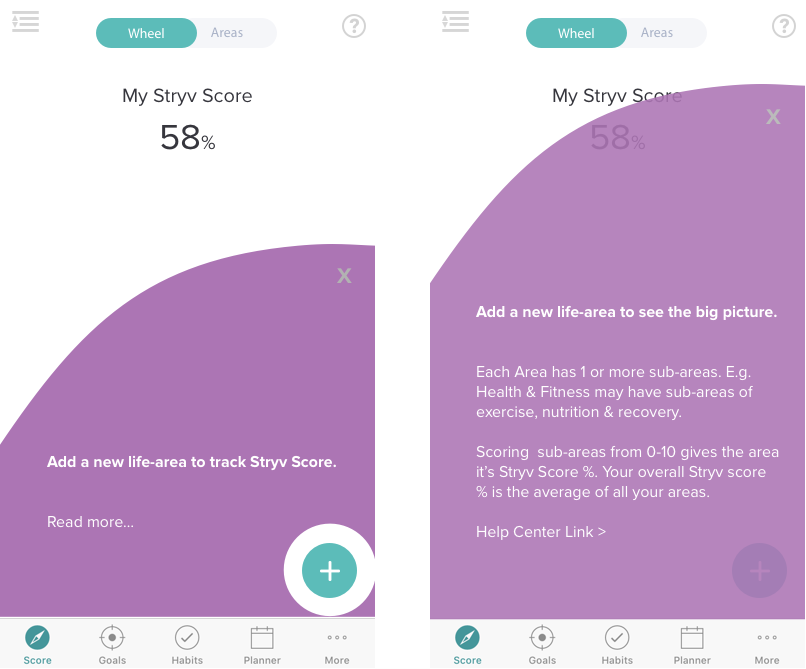

# Feature Tips

* Should have a curved header. Probably needs to be done as a mask or something so it's clear where it should be and the correct color where it should be
* When the user taps the "?" icon in the corner, the message slides up from the bottom.
    * Currently it just shows & hides, maybe make an animation
* It should be displayed automatically the first time the user visits the page.
    * It does this currently if the show input is set to true
    * Make sure it doesn't animate if we're just loading it open
    * Only animate on a transition
* If the user clicks "read more" move up higher to reveal additional text.
    * Same as above, make it animate
* X mark on top right dismisses the message.
    * Slide down animation
* We want to be able to adjust the color of the background if possible.
    * This already works
* Handle different screen sizes gracefully (ex: phone, tablet, desktop)
    * Works as it is, just make sure the curved header works on different sizes
    * Can be that the curve is on the left side of the header so on larger screens it's just flat across most of the top
